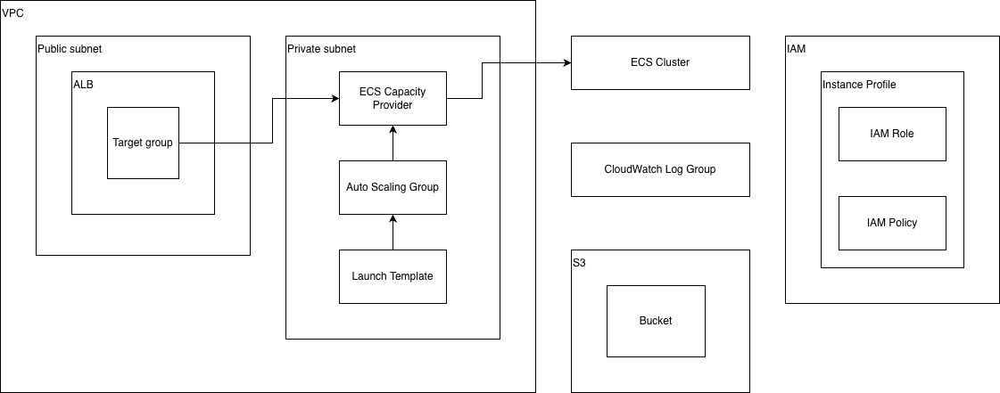

# OPH Environment Terraform Modules - Application Platform

## Dependencies

This module assumes the native network module is provisioned.

## Resources provisioned

The resources provisioned by this module are as follows:
- AWS CloudWatch Log Group
- AWS IAM Policy for AWS EC2 Launch Template
- AWS IAM Role for ECS
- AWS IAM Instance Profile for EC2 instance
- AWS S3 bucket for application storage needs
- AWS ECS Cluster
- AWS Security Group
- AWS EC2 Launch Template
- AWS Auto Scaling Group for AWS ECS Cluster