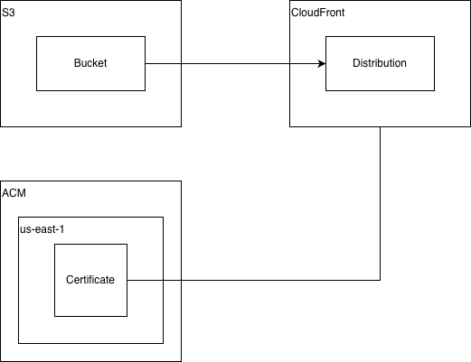

# OPH Environment Terraform Modules - Project - WWW

This module provisions infrastructure for hosting static website using AWS S3 for hosting, AWS CloudFront for distribution and ACM for an SSL certificate.

## Resources

The resources provisioned by this module are as follows:
- AWS ACM certificate for WWW URL
- AWS S3 Bucket for hosting static website
- AWS CloudFront Distribution, a CDN for the static website
- AWS Route53 DNS record for WWW URL